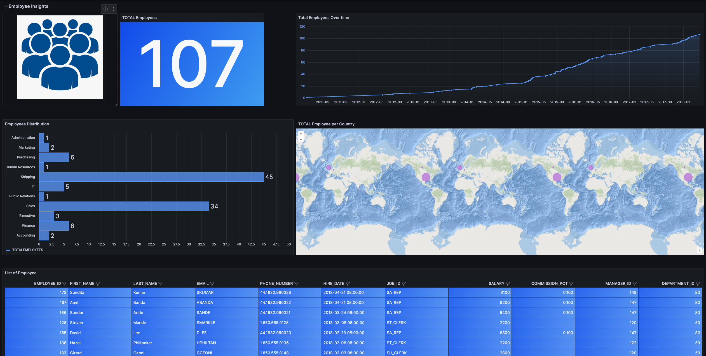
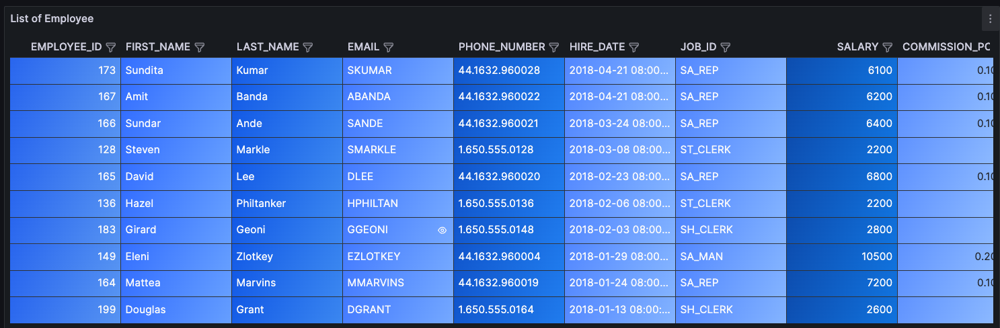
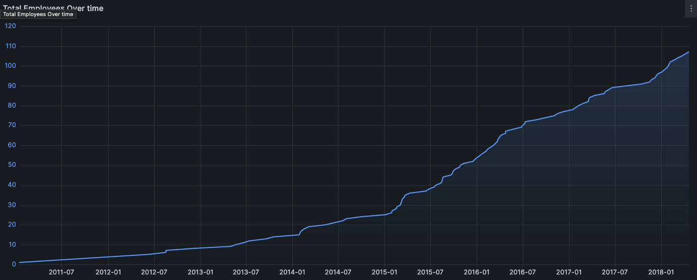
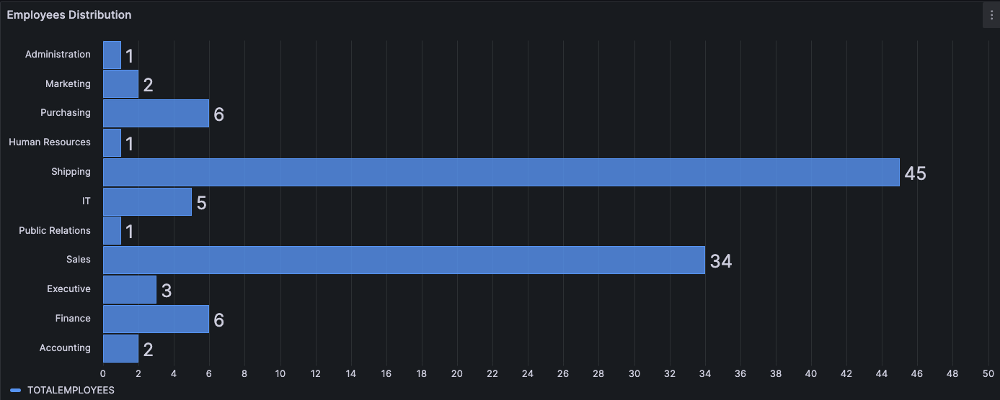
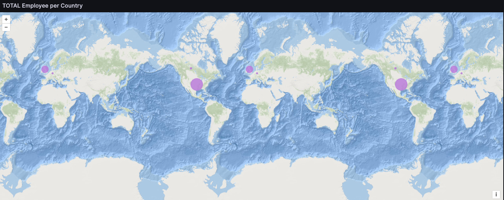
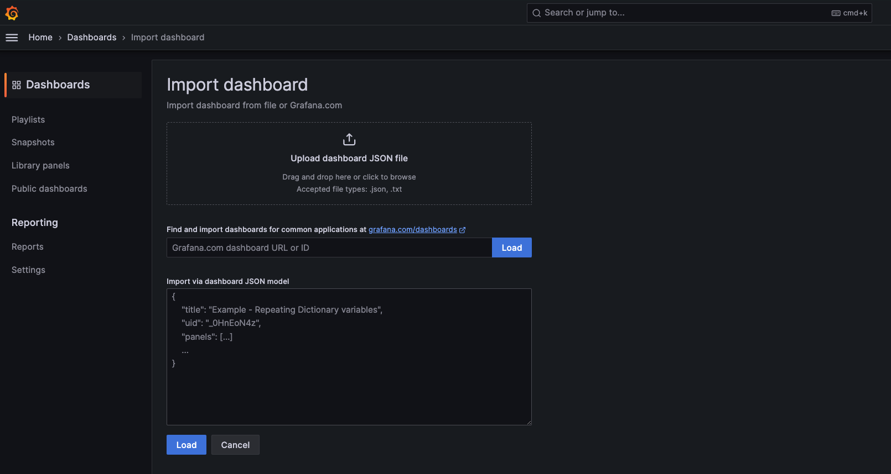

# OracleDB Dashboarding Walkthrough

We will be building Grafana dashboard with Oracle DB sample HR schema data.

For more context about the datasource, please refer to the [README](./README.md).

This is the final dashboard that we will be building:


**IMPORTANT**: Remember to SAVE your dashboard for every changes!

## Table panel with list of employee

SQL Statement:

```sql
SELECT *
FROM HR.EMPLOYEES
ORDER BY HIRE_DATE DESC
```

1. Add new panel, and choose the `Table` visualization
2. Input the SQL query into the query box (ensuring that you are using the OracleDB datasource)
3. Under `Format as`, choose `Table`
4. Click on `Run query` (top right corner of the query box)

### Improve panel view

**NOTE**: Each panel option in Grafana, provide a search bar options that we will use for this walkthrough to simplify the steps.

1. Search for `panel options` and update the following
   - `Title`: List of Employee
1. Search for `table` and update the following
   - Enable `Show table header`
   - Enable `Column filter`
   - Enable `Enable pagination`
1. Search for `cell` and update the following
   - Under `Cell type`, choose `Colored background`
   - Under `Background display mode`, choose `Gradient`
1. Search for `color` and update the following
   - Under `Color scheme`, choose `Shades of a color` and pick blue color.

Click on `Apply` and go back to the dashboard page.

**IMPORTANT**: Remember to SAVE your dashboard for every changes!

Final panel view:


## Timeseries panel to graph the total employee over time

SQL Statement:

```sql
select hire_date, sum(count(employee_id)) over (order by hire_date rows between unbounded preceding and current row) as total_emp
from hr.employees
group by hire_date
order by hire_date
```

1. Add new panel, and choose the `Timeseries` visualization
2. Input the SQL query into the query box (ensuring that you are using the OracleDB datasource)
3. Under `Format as`, choose `Time series`
4. Click on `Run query` (top right corner of the query box)

**NOTE**: If there is no data on the panel, click on `Zoom to data`.

### Improve panel view

**NOTE**: Each panel option in Grafana, provide a search bar options that we will use for this walkthrough to simplify the steps.

1. Search for `panel options` and update the following
   - `Title`: Total Employees over Time
1. Search for `legend` and update the following
   - Disable `Legend > Visibility`
1. Search for `graph` and update the following
   - Under `Graph styles > Line width`, choose `2`
   - Under `Graph styles > Fill opacity`, choose `20`
   - Under `Graph styles > Gradient mode`, choose `Opacity`
1. Search for `color` and update the following
   - Under `Axis > Color`, choose `Series`
   - Under `Color scheme`, choose `Shades of a color` and pick blue color.

Click on `Apply` and go back to the dashboard page.

**IMPORTANT**: Remember to SAVE your dashboard for every changes!

**NOTE**: Check `Save current time range as dashboard default` option to save your chosen time range from earlier.

Final panel view:


## Stat panel to show number of employee

SQL Statement:

```sql
SELECT COUNT(*) AS TotalEmployees
FROM HR.EMPLOYEES
```

1. Add new panel, and choose the `Stat` visualization
2. Input the SQL query into the query box (ensuring that you are using the OracleDB datasource)
3. Under `Format as`, choose `Time series`
4. Click on `Run query` (top right corner of the query box)

### Improve panel view

**NOTE**: Each panel option in Grafana, provide a search bar options that we will use for this walkthrough to simplify the steps.

1. Search for `panel options` and update the following
   - `Title`: Total Employees
1. Search for `color` and update the following
   - Under `Stat styles > Color mode`, choose `Background Gradient`
   - Under `Color scheme`, choose `Shades of a color` and pick blue color.

Click on `Apply` and go back to the dashboard page.

**IMPORTANT**: Remember to SAVE your dashboard for every changes!

Final panel view:


## Barchart panel to illustrate total employee distribution

SQL Statement:

```sql
SELECT D.DEPARTMENT_ID, D.DEPARTMENT_NAME, COUNT(*) AS TotalEmployees
FROM HR.EMPLOYEES E
JOIN HR.DEPARTMENTS D ON E.DEPARTMENT_ID = D.DEPARTMENT_ID
GROUP BY D.DEPARTMENT_ID, D.DEPARTMENT_NAME
```

1. Add new panel, and choose the `Bar chart` visualization
2. Input the SQL query into the query box (ensuring that you are using the OracleDB datasource)
3. Under `Format as`, choose `Time series`
4. Click on `Run query` (top right corner of the query box)

### Adding Transformation

1. Go to `Transform data` tab beside `Query` tab
2. Click on `Add transformation`
3. Select `Filter fields by name`
4. Uncheck the `DEPARTMENT_ID`

### Improve panel view

**NOTE**: Each panel option in Grafana, provide a search bar options that we will use for this walkthrough to simplify the steps.

1. Search for `panel options` and update the following
   - `Title`: Employees Distribution
1. Search for `bar` and update the following
   - Under `Bar chart > X Axis`, choose `DEPARTMENT_NAME`
   - Under `Bar chart > Orientation`, choose `Horizontal`
1. Search for `color` and update the following
   - Under `Color scheme`, choose `Shades of a color` and pick blue color.

Click on `Apply` and go back to the dashboard page.

**IMPORTANT**: Remember to SAVE your dashboard for every changes!

Final panel view:


## Geomap panel to illustrate total employee distribution geo location

SQL Statement:

```sql
SELECT C.COUNTRY_ID, COUNT(*) AS TotalEmployees
FROM HR.EMPLOYEES E
JOIN HR.DEPARTMENTS D ON E.DEPARTMENT_ID = D.DEPARTMENT_ID
JOIN HR.LOCATIONS L ON D.LOCATION_ID = L.LOCATION_ID
JOIN HR.COUNTRIES C ON L.COUNTRY_ID = C.COUNTRY_ID
GROUP BY C.COUNTRY_ID
```

1. Add new panel, and choose the `Geomap` visualization
2. Input the SQL query into the query box (ensuring that you are using the OracleDB datasource)
3. Under `Format as`, choose `Time series`
4. Click on `Run query` (top right corner of the query box)

**NOTE**: You may not see any data since we haven't configured the map panel yet.

### Improve panel view

**NOTE**: Each panel option in Grafana, provide a search bar options that we will use for this walkthrough to simplify the steps.

1. Search for `panel options` and update the following
   - `Title`: Employees Distribution
1. Search for `basemap` and update the following
   - Under `Basemap layer > Layer type`, choose `ArcGIS MapServer`
   - Under `Basemap layer > Server instance`, choose `World Ocean`
1. Search for `map layer` and update the following
   - Click on `Layer 1`, to show more option related to Layer 1
   - Under `Map layers > Location Mode`, choose `Lookup`
   - Under `Map layers > Lookup field`, choose `COUNTRY_ID`
   - Under `Map layers > Styles Size`, choose `TOTALEMPLOYEES`
   - Under `Color`, choose purple color for better contrast

Click on `Apply` and go back to the dashboard page.

**IMPORTANT**: Remember to SAVE your dashboard for every changes!

Final panel view:


## Arrange our panels for final touch

Finally, we need to arrange our panels so that the most important graphs are in that Z pattern, spaced appropriately, and properly sized.

### Create empty space panel

We may need to add some spacing to our dashboard. To do so, you can use `Text` panel.

1. Add new panel, and choose the `Text` visualization
2. Change the following panel options:
   - Under the `Panel Title`, remove the existing value so it is a blank value.
   - Enable the `Transparent background`
   - Under the `Content` box (part of panel option), remove the existing value

Click on `Apply` and go back to the dashboard page.

The panel we just created will make it look like there is an 'empty space' in our dashboard. You can rearrange and resize the panel to fit the final design. Furthermore, you can duplicate the panel by doing a `mouse-hover` to the panel, and click on the `3-dot icon` > `More` > `Duplicate`.

**NOTE**: 'Empty space' panel we just created is a good candidate for `library panel` so we can reuse in other dashboard as well. In order to save it as library panel, `mouse-hover` to the panel, and click on the `3-dot icon` > `More` > `Create library panel`.

**IMPORTANT**: Remember to SAVE your dashboard for every changes!

## (OPTIONAL) Import Final Dashboard

If you didn't quite finish but would like a working copy of our result you can import the dashboard. A copy of the final dashboard `.json` file is located in this repository. You can import it into your Grafana stack by either:

1. Download the `.json` file from this [repository](./resources/Employee%20Insights.json) and upload it under the Grafana _Import dashboard_ UI; or
2. Copy the content of the `.json` file from this [repository](./resources/Employee%20Insights.json) and paste it into the Grafana _Import dashboard_ UI

REF: Grafana Import Dashboard UI


After you `Load` the `.json` file into Grafana, it will ask you to choose your Oracle DB datasource.
